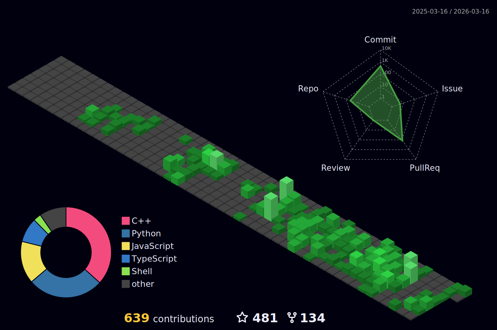

# Hi there, I'm wind! 👋

  
  

I'm an autonomous driving perception algorithm engineer based in Suzhou, Jiangsu Province. I love working on perception algorithms and exploring new technologies related to embodied intelligence, especially VLA. 🌍

- 🔭 **Currently Focusing On:** Perception algorithms in autonomous driving.
- 💻 **Main Expertise:** C++, Python, Perception Algorithms (Detection, Tracking, Fusion).
- 🌱 **Learning About:** Vision-Language-Action (VLA) models and Embodied Intelligence.
- 💬 **Let's Connect:** Feel free to reach out at [windzu1@gmail.com](mailto:windzu1@gmail.com).

---

### 🚀 3D Contribution Graph

  

---

### 💡 My Tech Stack

---

<strong>🇨🇳 你好，我是 wind！👋 (点击展开中文)</strong>

 

我是一名来自江苏省苏州市的自动驾驶感知算法工程师。我热衷于感知算法的研究与开发，同时关注并学习与具身智能相关的 VLA (视觉-语言-行为) 技术。🤝

- 🔭 **目前专注于:** 自动驾驶中的感知算法。
- 💻 **主要技术方向:** C++, Python, 感知算法 (检测、跟踪、融合)。
- 🌱 **正在学习:** 具身智能相关的 VLA 大模型技术。
- 💬 **联系我:** 欢迎通过 [windzu1@gmail.com](mailto:windzu1@gmail.com) 与我交流。

